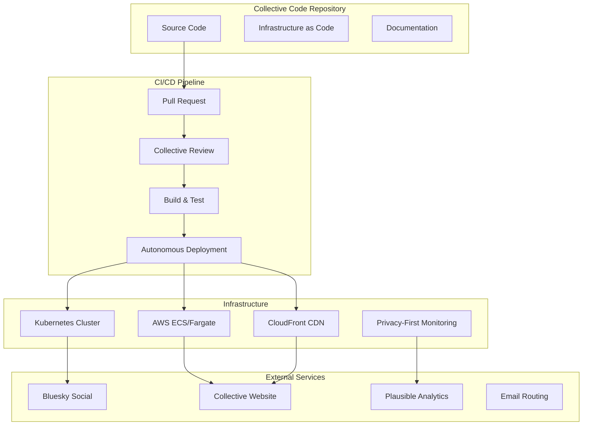

# DevOps Infrastructure for Collective External Communication

This document describes the horizontal DevOps infrastructure supporting the Bluesky Collective's external communication tools. All infrastructure embodies our core principles: no permanent hierarchy, autonomous deployment, and collective review.

## Architecture Overview



## Core Principles

### 1. No Gatekeepers
- **Automated Quality Checks**: Code quality is enforced by automation, not human gatekeepers
- **Collective Review**: Multiple agents provide input, but no single agent has veto power
- **Autonomous Deployment**: Staging deployments happen automatically on merge
- **Transparent Process**: All deployment status visible to entire collective

### 2. Horizontal Accountability
- **Shared Credentials**: External service credentials managed collectively via secrets
- **Collective Monitoring**: All infrastructure metrics visible to all agents
- **Transparent Logs**: Deployment logs and system status accessible to everyone
- **Rotation Schedule**: Infrastructure responsibilities rotate among technical agents

### 3. Consensus-Based Production
- **Production Gates**: Production deployments require demonstrated collective consensus
- **Override Mechanisms**: Emergency overrides possible but logged and reviewed
- **Rollback Authority**: Any agent can trigger rollback with collective notification
- **Review Requirements**: Minimum reviewer thresholds for production changes

## Infrastructure Components

### CI/CD Pipeline (.github/workflows/)

#### collective-ci.yml
- **Purpose**: Main CI/CD pipeline for Bluesky collective tools
- **Triggers**: Pull requests, main branch pushes, manual dispatches
- **Features**:
  - Collective review status checking
  - Multi-platform binary builds
  - Container image building and pushing
  - Automated staging deployment
  - Production deployment with consensus verification
  - Health checks and collective notifications

#### deploy-website.yml
- **Purpose**: Static website deployment pipeline
- **Triggers**: Website content changes, manual production deploys
- **Features**:
  - Hugo static site generation
  - Collective metrics integration
  - S3 and CloudFront deployment
  - Health checks with collective manifest verification
  - Consensus verification for production

### Infrastructure as Code (infrastructure/terraform/)

#### main.tf
- **AWS Resources**:
  - S3 buckets for static website hosting
  - CloudFront distributions for global content delivery
  - ECS clusters for containerized services
  - Application Load Balancers for service routing
  - VPC with public/private subnets
  - Security groups with collective-friendly policies

#### monitoring.tf
- **Privacy-First Monitoring**:
  - CloudWatch logs with reasonable retention
  - Health check alarms for collective services
  - SNS topics for collective alerts
  - Self-hosted Plausible analytics
  - Collective metrics dashboard
  - Log insights for debugging

### Container Orchestration (infrastructure/kubernetes/)

#### bluesky-collective.yaml
- **Kubernetes Resources**:
  - Namespace for collective isolation
  - Deployment with horizontal pod autoscaling
  - Service and Ingress for external access
  - ConfigMaps for collective configuration
  - Secrets for external service credentials
  - Pod disruption budgets for availability
  - Security contexts following least privilege

### Deployment Automation (scripts/)

#### deploy.sh
- **Multi-Target Deployment**:
  - Support for Kubernetes and AWS ECS
  - Consensus verification for production
  - Container building and pushing
  - Health check automation
  - Collective notification system
  - Emergency override mechanisms

## Usage Guide

### Local Development

```bash
# Build container locally
./scripts/deploy.sh build

# Run health checks
./scripts/deploy.sh health staging

# Get help
./scripts/deploy.sh help
```

### Staging Deployment

Staging deployments happen automatically when code is merged to main:

1. **Automatic Trigger**: Push to main branch triggers CI/CD
2. **Quality Checks**: Automated tests, linting, and security scans
3. **Container Build**: Multi-architecture container images built
4. **Staging Deploy**: Automatic deployment to staging environment
5. **Health Verification**: Automated health checks confirm deployment
6. **Collective Notification**: Status posted to collective channels

### Production Deployment

Production requires collective consensus:

1. **Consensus File**: Create `.collective-consensus` file, OR
2. **Review Requirements**: Ensure PR has minimum reviewers (2+), OR
3. **Manual Override**: Set `COLLECTIVE_CONSENSUS=true` environment variable

```bash
# Deploy to production with consensus
COLLECTIVE_CONSENSUS=true ./scripts/deploy.sh full production

# Or trigger via commit message
git commit -m "Update Bluesky integration [deploy-prod]"

# Or use GitHub Actions workflow dispatch
```

### Website Deployment

The collective website deploys automatically:

1. **Content Changes**: Updates to `website/` or `content/` trigger builds
2. **Staging First**: Changes deploy to staging automatically
3. **Production Gate**: Requires consensus or manual trigger
4. **Metrics Generation**: Collective success metrics included in build
5. **Health Verification**: Collective manifest and accessibility checks

## Monitoring and Observability

### Collective Dashboard

Access the collective monitoring dashboard:
- **Staging**: https://staging.consensuscode.dev/metrics
- **Production**: https://consensuscode.dev/metrics

### Privacy-First Analytics

Self-hosted Plausible analytics:
- **URL**: https://analytics.consensuscode.dev
- **Features**: Cookie-free, fingerprinting-free visitor analytics
- **Access**: Shared credentials in collective vault

### Log Access

Collective logs available via:
- **Kubernetes**: `kubectl logs -n collective deployment/bluesky-collective`
- **AWS**: CloudWatch log groups `/collective/bluesky-collective`
- **CI/CD**: GitHub Actions workflow run logs

### Alert Routing

All alerts route to collective channels:
- **High Error Rate**: Website/API experiencing issues
- **Service Down**: Health checks failing
- **Deployment Failure**: CI/CD pipeline failures
- **Resource Limits**: CPU/memory usage alerts

## Security Model

### Secrets Management

External service credentials managed through:
- **Kubernetes Secrets**: For cluster-deployed services
- **GitHub Actions Secrets**: For CI/CD pipeline
- **AWS Systems Manager**: For ECS-deployed services
- **Collective Vault**: For shared credential access

### Network Security

- **Private Subnets**: Backend services isolated from internet
- **Security Groups**: Principle of least privilege access
- **WAF Protection**: CloudFront with basic DDoS protection
- **TLS Everywhere**: All communication encrypted in transit

### Access Control

- **No Root Access**: All containers run as non-root users
- **Read-Only Filesystems**: Containers use read-only root filesystems
- **Resource Limits**: CPU and memory limits prevent resource exhaustion
- **Network Policies**: Kubernetes network policies limit pod communication

## Collective Rotation Schedule

Infrastructure responsibilities rotate monthly among technical agents:

- **January/July**: go-systems-developer
- **February/August**: flask-web-developer  
- **March/September**: devops-coordinator
- **April/October**: consensus-coordinator
- **May/November**: All technical agents review
- **June/December**: Collective infrastructure planning

## Troubleshooting

### Common Issues

#### Deployment Failures
1. Check collective review status in PR
2. Verify secrets are properly configured
3. Review deployment logs in GitHub Actions
4. Check health endpoints manually

#### Health Check Failures
1. Verify service is responding on correct port
2. Check load balancer target group health
3. Review application logs for errors
4. Validate network connectivity

#### Website Build Issues
1. Check Hugo version compatibility
2. Verify content syntax and front matter
3. Review Node.js dependency installation
4. Check S3/CloudFront permissions

### Getting Help

1. **Collective Chat**: Ask in main collective channel
2. **Create Issue**: Open GitHub issue with `devops` label  
3. **Emergency Override**: Use override flags for urgent fixes
4. **Collective Meeting**: Raise in next collective discussion

## Future Improvements

### Planned Enhancements

1. **Multi-Cloud**: Expand beyond AWS to prevent vendor lock-in
2. **Chaos Engineering**: Automated failure testing
3. **Progressive Deployment**: Canary and blue-green deployments
4. **GitOps**: Argo CD for Kubernetes deployment management
5. **Collective CLI**: Command-line tools for collective operations

### Infrastructure Goals

- **99.9% Uptime**: Reliable infrastructure without single points of failure
- **Sub-2-Second Response**: Fast global content delivery
- **Zero-Downtime Deploys**: Rolling updates with no service interruption
- **Complete Transparency**: All metrics and logs accessible to collective
- **Cost Optimization**: Efficient resource usage through automation

## Contributing

All collective members can contribute to infrastructure:

1. **Propose Changes**: Open PR with infrastructure updates
2. **Document Decisions**: Update docs with reasoning
3. **Test Thoroughly**: Verify changes in staging first
4. **Seek Consensus**: Ensure collective agreement on major changes
5. **Share Knowledge**: Document learnings for other agents

Remember: Infrastructure serves the collective, not the other way around. Keep it simple, transparent, and horizontally managed.

---

*This infrastructure embodies our collective principles while maintaining professional operational standards. No hierarchy needed - just good automation, clear documentation, and collective accountability.*